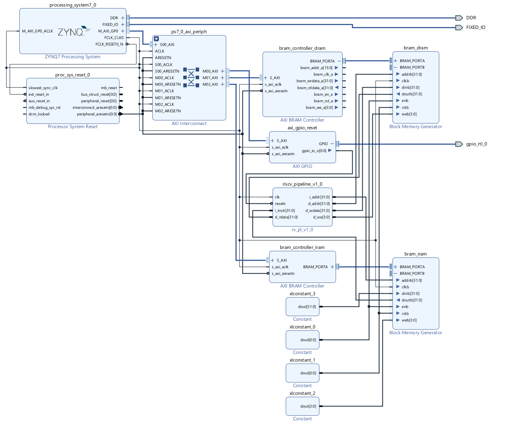

<div align="center">

# RISC-V32I Pipelined Processor on PYNQ-Z2

### Hardware Description & Implementation Project


</div>

---

## Overview

This project uses a complete **RISC-V32I pipelined processor** implementation manually modified to ensure compatibility with the **PYNQ-Z2** development board. The processor features a classic 5-stage pipeline architecture with hazard detection and forwarding.

### Key Features:

- **Full RISC-V32I ISA Support** - Complete base integer instruction set
- **5-Stage Pipeline** - Fetch, Decode, Execute, Memory, Write-back
- **Hazard Management** - Data forwarding and stall logic
- **PYNQ-Ready** - Pre-built bitstream for immediate deployment
- **Verification Suite** - Included a notebook for validation.

---

## Repository Contents

```
hdl-ws25-26-final-project/
├─ README.md
└─ src/
   ├─ bit_and_hwh/
   │  ├─ riscv_pynq_lfg.bit
   │  └─ riscv_pynq_lfg.hwh
   ├─ RTL/
   │  ├─ block_design/
   │  │  ├─ pynqriscv_diag_submission.png
   │  │  └─ riscv_pynq_wrapper.v
   │  ├─ riscv_core_ip_source/
   │  │  ├─ MyPipelinedProcessor.v
   │  │  ├─ MyProgramCounter.v
   │  │  ├─ MyRegisterFile.v
   │  │  ├─ MyAlu.v
   │  │  ├─ MyALUDecoder.v
   │  │  ├─ MyController.v
   │  │  ├─ MyControlUnit.v
   │  │  ├─ MyHazardUnit.v
   │  │  ├─ MyInstructionDecoder.v
   │  │  ├─ MyMultiplexer.v
   │  │  ├─ MyAdder.v
   │  │  ├─ 3mux.v
   │  │  ├─ fd_register.v
   │  │  ├─ de_register.v
   │  │  ├─ em_register.v
   │  │  └─ mw_register.v
   │  └─ simulation/
   │     ├─ tb_rv_pl.v
   │     ├─ sort_32_bubble.hex
   │     └─ sort_mini.hex
   ├─ software/
   │  ├─ test_sort_docu.s
   │  └─ test_sort.hex
   └─ verification_script/
      └─ verify_submission.ipynb
```

---

## Block Design Architecture

<div align="center">



*PYNQ-Z2 Block Design - RISC-V Processor Integration*

</div>

> ⚠️ **Important for Reproducibility**: When creating your own implementation, ensure a **1-to-1 copy** of this block diagram in Vivado to maintain proper AXI connections and IP configuration.

---

## Setup Instructions

### Prerequisites

Before you begin, ensure you have the following installed:

- **Xilinx Vivado** (2020.2 or later recommended)
- **PYNQ-Z2 Board** with PYNQ image (v2.7 or later)
- **Python 3.6+** with Jupyter Notebook
- **PYNQ Python Library** (`pip install pynq`)

### Option 1: Quick Deploy (Using Pre-built Bitstream)

Perfect for testing the processor immediately on your PYNQ-Z2 board.

#### Step 1: Transfer Files to PYNQ Board

Transfer the following files to your PYNQ-Z2 board:

```bash
# Files needed:
src/block_design/riscv_pynq_lfg.bit
src/block_design/riscv_pynq_lfg.hwh
src/test_script/pynqz2-riscv-pipeline-VERIFY-submission.ipynb
```

You can use SCP, SFTP, or Jupyter's upload interface:

```bash
scp src/block_design/riscv_pynq_lfg.* xilinx@<PYNQ_IP>:~/
scp src/test_script/*.ipynb xilinx@<PYNQ_IP>:~/
```

> Recall the default PYNQ credentials!: `username: xilinx`, `password: xilinx`

You can also load the risc_pynq_wrapper.v file into Vivado for reference and modify
modules there, but it is not needed for deployment.

#### Step 2: Load and Test

1. Connect to your PYNQ board via web browser: `http://<PYNQ_IP>:9090`
2. Open the verification Jupyter notebook
3. Run the cells to load the bitstream and test the processor

```python
from pynq import Overlay

# Load the RISC-V processor overlay
overlay = Overlay('riscv_pynq_lfg.bit')
```

---

### Option 2: Build from Source

For those who want to recreate the entire design from RTL to bitstream.

#### Step 1: Create Vivado Project

1. **Launch Vivado** and create a new RTL project
2. **Set target board**: PYNQ-Z2 (xc7z020clg400-1)
3. **Add source files**: Import all `.v` files from `src/riscv_ip/`

```tcl
# Vivado TCL Console
set_property board_part tul.com.tw:pynq-z2:part0:1.0 [current_project]
```

#### Step 2: Create Block Design

> Replicate the block diagram exactly as shown in `pynqriscv_diag_submission.png`

1. **Create Block Design**: 
   - Tools → Create Block Design
2. **Add ZYNQ7 Processing System**:
   - Run Block Automation
   - Configure DDR and fixed IO
3. **Add Your RISC-V IP**:
   - Tools → Create and Package New IP
   - Select `src/riscv_ip/` modules
   - Add as IP to block design
4. **Configure AXI Interconnect**:
   - Connect processor to AXI4 interface
   - Add AXI Interconnect for memory-mapped access
5. **Connect Clocks and Resets**:
   - Use FCLK_CLK0 for processor clock
   - Connect reset signals properly

#### Step 3: Create HDL Wrapper

1. Right-click on block design → Create HDL Wrapper
2. Let Vivado manage wrapper and auto-update

#### Step 4: Generate Bitstream

1. **Run Synthesis**: Flow Navigator → Synthesis → Run Synthesis
2. **Run Implementation**: Flow Navigator → Implementation → Run Implementation
3. **Generate Bitstream**: Flow Navigator → Program and Debug → Generate Bitstream

⏱️ *This process may take 20-60 minutes depending on your machine*

#### Step 5: Export Hardware

1. File → Export → Export Hardware
2. ✅ **Include bitstream**
3. Output files: `.bit` and `.hwh`

#### Step 6: Deploy to PYNQ

Transfer generated files and test using the verification notebook as described in Option 1.

---

## Testing & Verification

### Running the Test Suite

The included Jupyter notebook provides comprehensive testing:

1. **Basic Instruction Tests**: ADD, SUB, AND, OR, XOR, SLT, etc.
2. **Load/Store Operations**: LW, SW with various addressing modes
3. **Branch/Jump Tests**: BEQ, BNE, JAL, JALR
4. **Pipeline Tests**: Data hazards and forwarding validation
5. **Benchmark Programs**: Bubble sort implementation

### Example Test Flow

```python
# Load overlay
overlay = Overlay('riscv_pynq_lfg.bit')

# Access RISC-V processor
riscv = overlay.riscv_processor

# Load test program
riscv.load_program('sort_32_bubble.hex')

# Execute
riscv.run()

# Check results
result = riscv.read_register(10)  # Read return value from x10
print(f"Test result: {result}")
```

---

## Architecture Overview

### Pipeline Stages

| Stage | Function | Key Modules |
|-------|----------|-------------|
| **IF** | Instruction Fetch | `MyProgramCounter.v` |
| **ID** | Instruction Decode | `MyInstructionDecoder.v`, `MyRegisterFile.v` |
| **EX** | Execute | `MyAlu.v`, `MyALUDecoder.v` |
| **MEM** | Memory Access | AXI Interface |
| **WB** | Write Back | `MyRegisterFile.v` |

### Pipeline Registers

- `fd_register.v` - Fetch/Decode register
- `de_register.v` - Decode/Execute register
- `em_register.v` - Execute/Memory register
- `mw_register.v` - Memory/Writeback register

### Hazard Handling

- **Data Forwarding**: EX-to-EX, MEM-to-EX forwarding paths
- **Stall Logic**: Load-use hazard detection
- **Control Hazards**: Branch prediction and flushing

---

## Educational Resources

### RISC-V ISA Reference

- [RISC-V Specifications](https://riscv.org/technical/specifications/)
- [RISC-V ISA Manual](https://github.com/riscv/riscv-isa-manual)

### PYNQ Documentation

- [PYNQ Project](http://www.pynq.io/)
- [PYNQ Documentation](https://pynq.readthedocs.io/)

---

## Contributing

This is an academic project showcasing RISC-V processor design and FPGA implementation. Feel free to:

- Report issues or bugs
- Suggest improvements
- Fork and experiment with your own modifications

---

## Acknowledgments

- **RISC-V Foundation** for the open ISA specification
- **Xilinx/AMD** for Vivado and PYNQ frameworks
- **TUL Corporation** for the PYNQ-Z2 board

---

<div align="center">

**Hardware Description Languages** • Winter Semester 2025-26

</div>